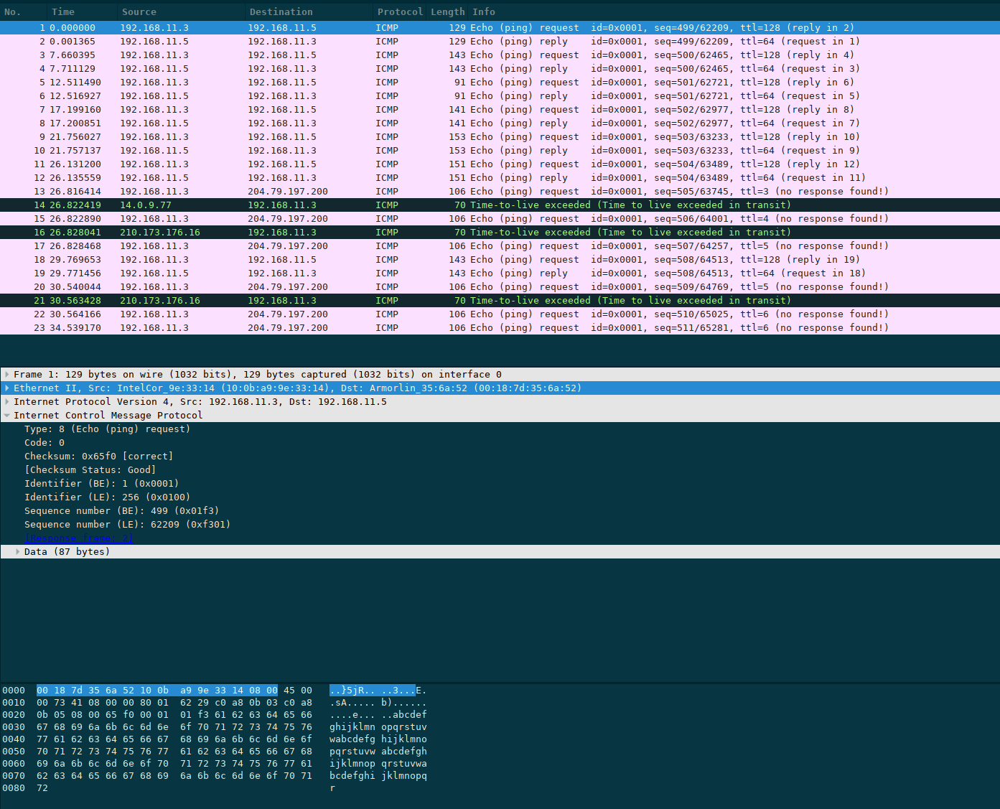
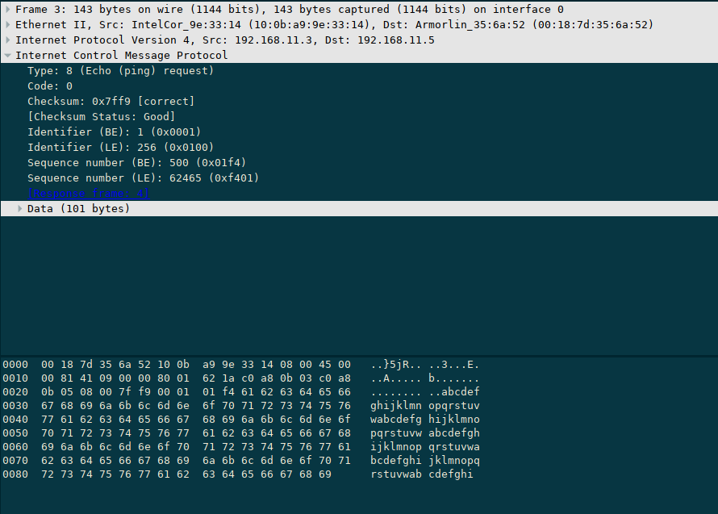

# mondai.zip Tokyo Westerns 2018

Let's start by looking at the file we are given.

```
$ file mondai.zip
mondai.zip: Zip archive data, at least v2.0 to extract
```

Okay, this appears to be a normal zip file.  Let's try to extract it.

```
$ mondai unzip mondai.zip
Archive:  mondai.zip
 extracting: y0k0s0.zip
$ file y0k0s0.zip
y0k0s0.zip: Zip archive data, at least v2.0 to extract
```

### y0k0s0.zip

Okay, we have another zip file.  Let's try to extract this one.

```
$ unzip y0k0s0.zip
Archive:  y0k0s0.zip
[y0k0s0.zip] capture.pcapng password:
```

So this zip file requires a password.  Since we don't have anything else other than these two zip files so far, let's just try the name of the zip file without the extension.

```
$ unzip y0k0s0.zip
Archive:  y0k0s0.zip
[y0k0s0.zip] capture.pcapng password: y0k0s0
  inflating: capture.pcapng
replace mondai.zip? [y]es, [n]o, [A]ll, [N]one, [r]ename: r
new name: mondai1.zip
  inflating: mondai1.zip
```

### mondai1.zip

Looks like that was a luck guess!  Now we have two files, a pcapng file and another zip file, which is renamed from mondai.zip to mondai1.zip.

```
$ unzip mondai1.zip
Archive:  mondai1.zip
[mondai1.zip] list.txt password: 
```

And the mondai1.zip also requres a password.  Let's look at capture.pcapng in Wireshark.



As seen in packet 1, this is and looks like a normal ICMP packet.  The rest of the packets that have been successfuly replied to look very similar to this one.  Let's lok at the next set of requests and replies starting in packet 3.



Other than the differences of sequence numbers, these packets are basically the same, except for their length of their data sections.  For each set of requsts and replies, let's make a table of the length of the data sections in hex and see if anything interesting comes up.

| Packet # | Data Length |
|----------|-------------|
| 1        | 0x57        |
| 3        | 0x65        |
| 5        | 0x31        |
| 7        | 0x63        |
| 9        | 0x6F        |
| 11       | 0x6D        |
| 18       | 0x65        |

All the data lengths of each pair of packets appear to be in the ASCII range that includes the numbers and alphabet.  Turning these hex numbers into ASCII gives us We1come.  Let's try that as our password for mondai1.zip.

```
$ unzip mondai1.zip
Archive:  mondai1.zip
[mondai1.zip] list.txt password: We1come
  inflating: list.txt
replace mondai.zip? [y]es, [n]o, [A]ll, [N]one, [r]ename: r
new name: mondai2.zip
  inflating: mondai2.zip 
```

Nice!  We have another zip file now, mondai.zip, which will be renamed to mondai2.zip.

### mondai2.zip

Other than mondai2.zip, there is also a list.txt file.  Let's see what is in it.

```
nb`_hlPYgZ
dhuYP\pUks
uSXWbQPtiY
cnbs_Yeahn
ui\R_ReZ[m
gZW^b]Sjqg
^RT\nmZ`^`
mnXgPr\^[T
erRQSov[uY
lkWdn[_oTj
kkc_tssYPo
XtlRPgv\nb
vc`oZv[ch\
...
```

The strings seem pretty random in this file.  Let's see what happens when we attempt to crack the password using list.txt as a dictionary file.

```
$ fcrackzip -v -D -u -p list.txt mondai2.zip
found file '1c9ed78bab3f2d33140cbce7ea223894', (size cp/uc    560/   618, flags 1, chk 5361)


PASSWORD FOUND!!!!: pw == eVjbtTpvkU
$ unzip mondai2.zip
Archive:  mondai2.zip
[mondai2.zip] 1c9ed78bab3f2d33140cbce7ea223894 password: eVjbtTpvkU
  inflating: 1c9ed78bab3f2d33140cbce7ea223894
```

Nice!  By using fcrackzip with list.txt as a dictionary file, fcrackzip is able to figure out that the password is eVjbtTpvkU.

### 1c9ed78bab3f2d33140cbce7ea223894

Our file from mondai2.zip does not appear to have an extension, so let's see what type of file it is.

```
$ file 1c9ed78bab3f2d33140cbce7ea223894 
1c9ed78bab3f2d33140cbce7ea223894: Zip archive data, at least v2.0 to extract
$ unzip 1c9ed78bab3f2d33140cbce7ea223894 
Archive:  1c9ed78bab3f2d33140cbce7ea223894
[1c9ed78bab3f2d33140cbce7ea223894] mondai.zip password: 
```

It's just a zip file, but the filename is interesting.  It looks like a hash, so it probably needs to be reversed, so let's assume it is a MD5 hash.  To reverse the hash, let's use an online utility like the one at https://isc.sans.edu/tools/reversehash.html.

Using the hash reverser from SANS, the hash is the hash of the string happyhappyhappy.  Let's try using that as the pasword for our zip file.

```
$ unzip 1c9ed78bab3f2d33140cbce7ea223894
Archive:  1c9ed78bab3f2d33140cbce7ea223894
[1c9ed78bab3f2d33140cbce7ea223894] mondai.zip password: happyhappyhappy
replace mondai.zip? [y]es, [n]o, [A]ll, [N]one, [r]ename: r
new name: mondai3.zip
  inflating: mondai3.zip
 extracting: README.txt
```

Nice!  We have another zip file, which has been renamed to mondai3.zip.

### mondai3.zip

The other file that was in 1c9ed78bab3f2d33140cbce7ea223894, README.txt contains the following:

```
password is too short
```

This most likely means the password is short enough to be able to bruteforce the password.  Let's try using fcrackzip again, but without a dictionary this time, and if we get a password, extract our zip file.

```
$ fcrackzip -v -l 1-10 -u mondai3.zip
found file 'secret.txt', (size cp/uc    144/   167, flags 1, chk 4fd5)


PASSWORD FOUND!!!!: pw == to
$ unzip mondai3.zip
Archive:  mondai3.zip
[mondai3.zip] secret.txt password: to
  inflating: secret.txt
```

### secret.txt

Nice!  Looks like we finally got the secret that is buried in the original mondai.zip file.  secret.txt contains the following:

```
Congratulation!
You got my secret!

Please replace as follows:
(1) = first password
(2) = second password
(3) = third password
...

TWCTF{(2)_(5)_(1)_(4)_(3)}
```

Nice!  We have everything we need to get the flag now.  Using the instructions in secret.txt, the flag for this challenge is TWCTF{We1come_to_y0k0s0_happyhappyhappy_eVjbtTpvkU}.
